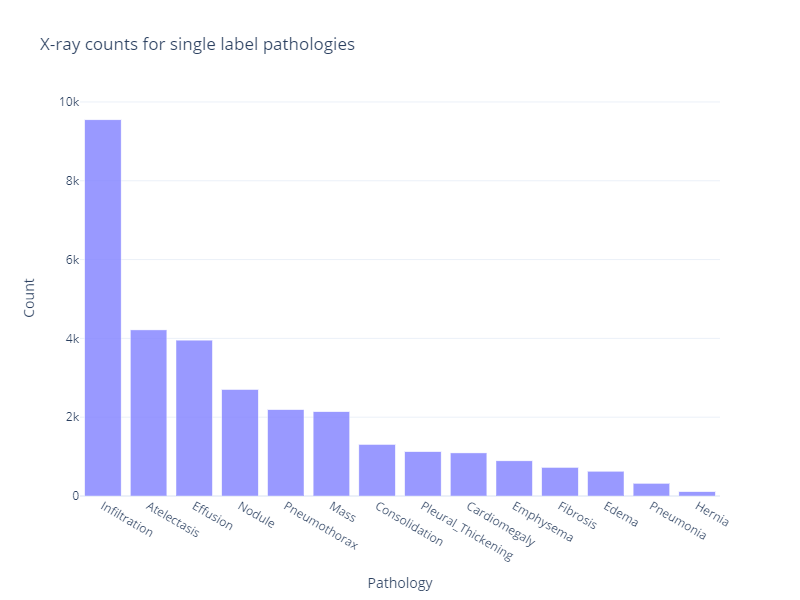
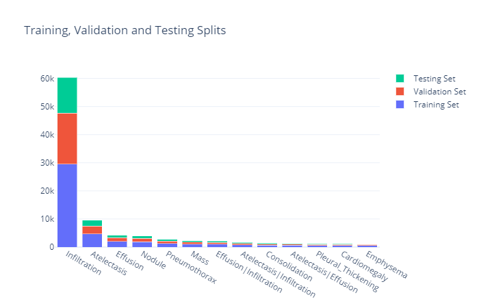

# Chest X-Ray Analysis - AI Powered Pathology Detection

# Ø. Introduction

- On Septemeber, 27 2017 [NIH](https://www.nih.gov/news-events/news-releases/nih-clinical-center-provides-one-largest-publicly-available-chest-x-ray-datasets-scientific-community) released one of the largest [datasets](https://nihcc.app.box.com/v/ChestXray-NIHCC) available on chest X-rays.
- Data has 45+ GB of images, , 112,000 anonymized chest x-ray images  (1024 x 1024 px), more than 30,000 patients, and 14 different chest conditions.

- **Main objective** of this project is to apply deep learning techniques through convolutional neural networks and create a model that shows a promising prediction on classifying these pathologies. The Project aims to help areas/clinics with shortage radiologists with a pre-diagnosis technique that can predict the chest conditions. Such work would require careful observation and knowledge of anatomical principles, physiology and pathology.

- The project was presented to Flatiron School Alumni on Dec 5th, 2019 and the presentation file is located in the _presentation_ folder.

# I. Methods
- The **key metric** used for this evaluation was the ROC score.
- Due to the size of the project and the huge processing power required to analyze 112k+ chest x-rays each with 1024 x 1024 pixels, project was run on a google cloud instance with JupyterLab and a nVIDIA GPU. 

- Since most visualizations are done via plotly, it is recommended to check notebooks through nbviewer (nbviewer seem sto have an issue with plotly atm).
- Notebook [```000-data_download.ipynb```](https://nbviewer.jupyter.org/github/YM88/NIH-Chest-X-ray-Pathology-Detection/blob/master/000-data_download.ipynb) downloads the data through a python script, extracts all images to the _data/images_ folder and removes all the downloaded zip files in the end.

- Notebook [```100-data_cleaning_eda.ipynb```](https://nbviewer.jupyter.org/github/YM88/NIH-Chest-X-ray-Pathology-Detection/blob/master/100-data_cleaning_eda.ipynb) imports the required libraries, data, creates the subset, one hot encodes the labels and saves the subset to _subset_ folder. Also the train, validation and test splits are done with following values:
- **subset data values:** 109577
- **training set values:**  53692
- **validation set values:**  32874
- **testing set values:**  23011  
Finally the splits are visualized and each subset is saved to the _subset_ folder. 



