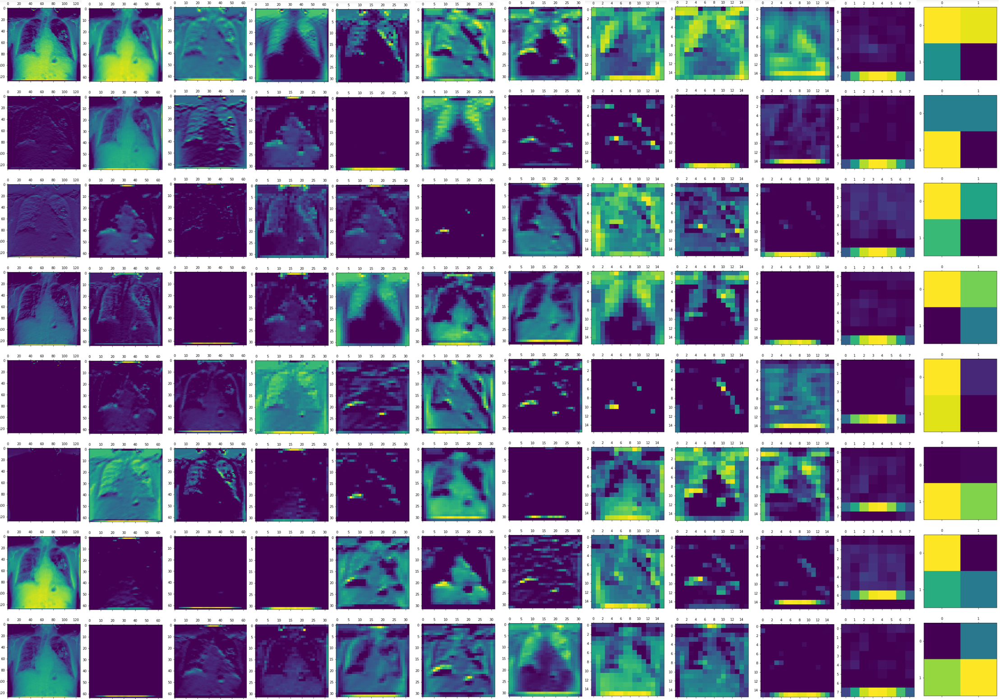
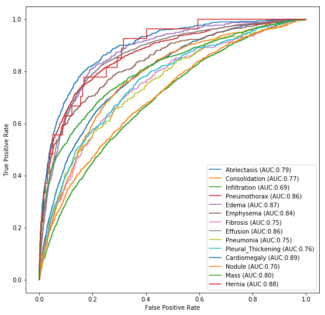

# Chest X-Ray Analysis - AI Powered Pathology Detection

# Ø. Introduction

  

- On Septemeber, 27 2017 [NIH](https://www.nih.gov/news-events/news-releases/nih-clinical-center-provides-one-largest-publicly-available-chest-x-ray-datasets-scientific-community) released one of the largest [datasets](https://nihcc.app.box.com/v/ChestXray-NIHCC) available on chest X-rays.
- Data has 45+ GB of images, , 112,000 anonymized chest x-ray images  (1024 x 1024 px), more than 30,000 patients, and 14 different chest conditions.

- **Main objective** of this project is to apply deep learning techniques through convolutional neural networks and create a model that shows a promising prediction on classifying these pathologies. The project aims to help areas/clinics with shortage of radiologists with a pre-diagnosis technique that can predict the chest conditions. Such work would require careful observation and knowledge of anatomical principles, physiology and pathology.

- The project was presented to Flatiron School Alumni on Dec 5th, 2019 and the presentation file is located in the _presentation_ folder.

# I. Methods
- The **key metric** used for this evaluation was the ROC score.
- Due to the size of the project and the huge processing power required to analyze 112k+ chest x-rays each with 1024 x 1024 pixels, project was run on a google cloud instance with JupyterLab, 8 core CPU, and a nVIDIA Tesla K80 GPU. 

- Since most visualizations are done via plotly, it is recommended to check notebooks through nbviewer which is available through the hyperlinks.

- Notebook [```000-data_download.ipynb```](https://nbviewer.jupyter.org/github/YM88/NIH-Chest-X-ray-Pathology-Detection/blob/master/000-data_download.ipynb) downloads the data through a python script, extracts all images to the _data/images_ folder and removes all the downloaded zip files in the end to save disk space.

- Notebook [```100-data_cleaning_eda.ipynb```](https://nbviewer.jupyter.org/github/YM88/NIH-Chest-X-ray-Pathology-Detection/blob/master/100-data_cleaning_eda.ipynb) imports the required libraries, data, creates the subset, one hot encodes the labels and saves the subsets to _subset_ folder. After removing the images that have less than 20 instances with their specified findings, the total number of images in the subset falls down to 106577. Later the train, validation and test splits are done with following values:
- **subset data values:** 109577
- **training set values:**  53692
- **validation set values:**  32874
- **testing set values:**  23011  
  

to zoom in the visualization and look at the interactive plot, pleae view the notebook in the nbviewer by clicking on the hyperlinks of the notebooks.


- Notebooks [```200-basemodel_cnn_scratch.ipynb```](https://nbviewer.jupyter.org/github/YM88/NIH-Chest-X-ray-Pathology-Detection/blob/master/200-basemodel_cnn_scratch.ipynb) and [```210-pretrained_models.ipynb```](https://nbviewer.jupyter.org/github/YM88/NIH-Chest-X-ray-Pathology-Detection/blob/master/210-pretrained_model.ipynb) both import the saved(pickled) training and validation sets from the _subset_ folder. 


The ImageDataGenerator of tensorflow preprocessing is used to rescale the RGB range (0-255) to 0-1 values. Also samplewise centering and standard normalization is done. Minor shifting on both height and width, zooming, and rotation is also applied  on the x-rays to introduce some noise on the images since the original x-rays have some random zooming and minor rotations as well. fill_mode is set to 'reflect' to fill the boundaries with the reverse of the image in that areas.  

Traning history, ROC plots, prediction per class results are all visualized for both base model and pretrained mobilenet model. Notebook 200 has also the visualization of one chosen chest x-ray to be shown on the presentation by converting back the float numbers to their represented images as a way to open up the "black box" of the convolutional neural networks. This is done to be used both on the presentation slides and the top figure of this README.md file.

 * for both models the _log_ folder includes the training history:  
 
    1. Model summaries are saved in *.txt format.  
 
    2. Traning logs including epoch number, auc score, and validation loss are saved as a *.csv file.

 * baseline model and pretrained models are saved in _cnnmodels_ as *.h5 file formats and their best weights are saved in the _weights_ folder as *.hdf5.

- Models are tested on the held out test dataset on notebooks [```300-testing_baseline.ipynb```](https://nbviewer.jupyter.org/github/YM88/NIH-Chest-X-ray-Pathology-Detection/blob/master/300-testing_baseline.ipynb) and [```311-testing_pretrained_mobilenet.ipynb```](https://nbviewer.jupyter.org/github/YM88/NIH-Chest-X-ray-Pathology-Detection/blob/master/311-testing_pretrained_mobilenet.ipynb) and their diagnosis predictions are saved in the _test results_ folder as *.csv files. these files are then used in notebook  [```400-visualization_predictions_results.ipynb```](https://nbviewer.jupyter.org/github/YM88/NIH-Chest-X-ray-Pathology-Detection/blob/master/400-visualization_predictions_results.ipynb) to visualize the difference on the predicted diagnosis of the two models versus the actual diagnosis.


# II. Results
Both models show promising results. As expected the pretrained mobilenet model also in many categories show a higher 5-10% AUC score.

## Baseline AUC per label
  

## Pretrained Mobilenet AUC per label



 # III. Discussion 
Due to the shortage of time and the limited budget to run models on google cloud, there was not much time left to properly fine tune the model and apply contrast optimizations


